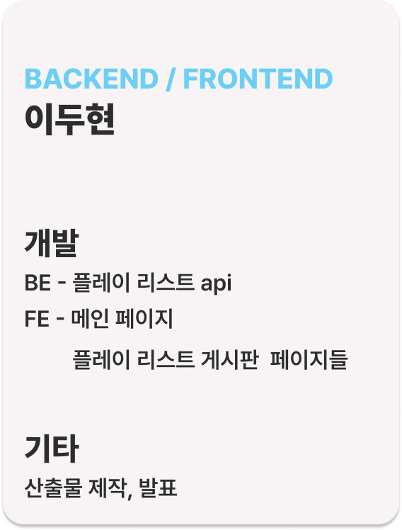
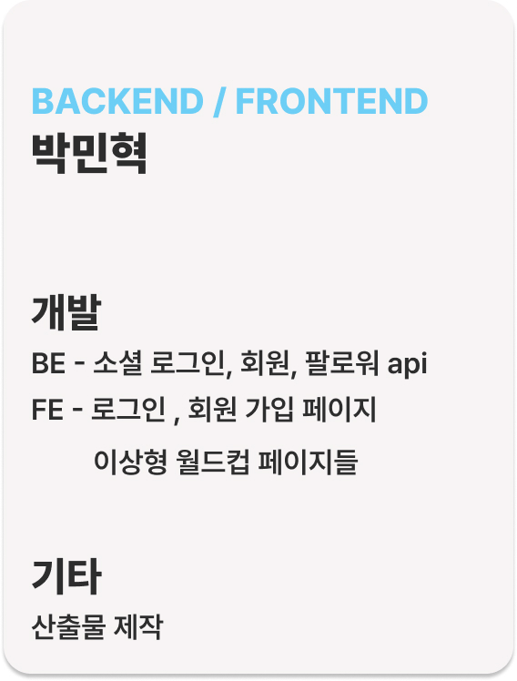
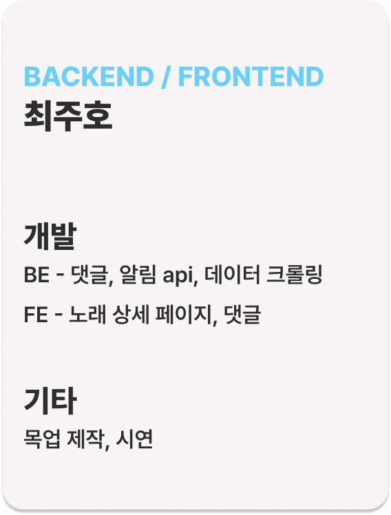
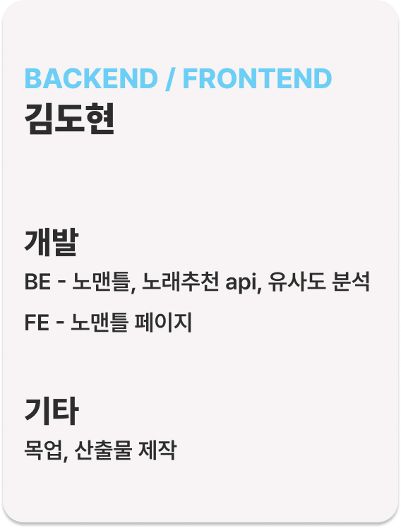
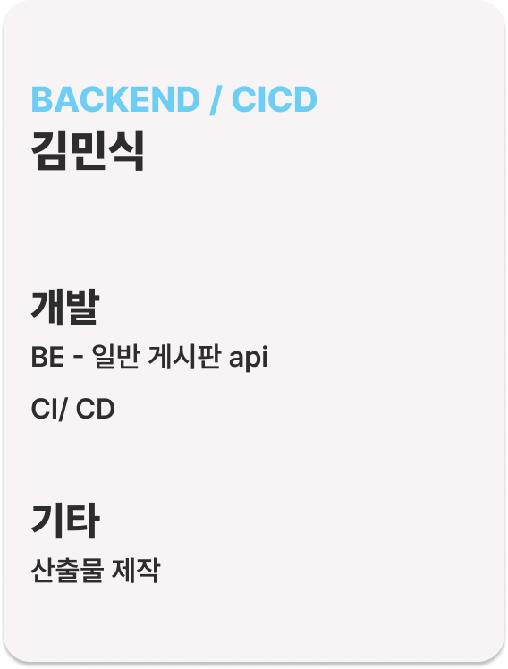
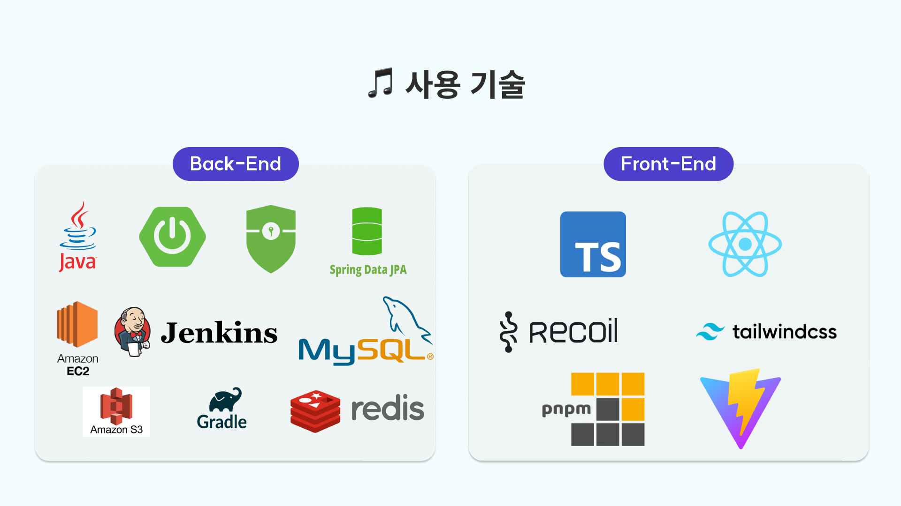
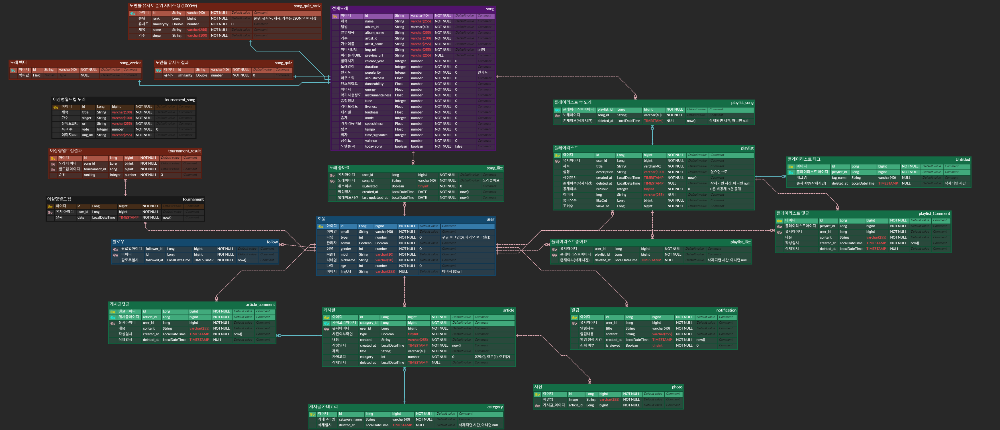

# 🎵 YESRAE

## A304 - 노래 추천 프로젝트 (빅데이터 추천)

<!-- 필수 항목 -->

## 카테고리

| Application                       | Domain                                | Language                      | Framework                               |
| --------------------------------- | ------------------------------------- | ----------------------------- | --------------------------------------- |
| :white_check_mark: Desktop Web    | :black_square_button: AI              | :white_check_mark: JavaScript | :black_square_button: Vue.js            |
| :black_square_button: Mobile Web  | :white_check_mark: Big Data           | :white_check_mark: TypeScript | :white_check_mark: React                |
| :white_check_mark: Responsive Web | :black_square_button: Blockchain      | :black_square_button: C/C++   | :black_square_button: Angular           |
| :black_square_button: Android App | :black_square_button: IoT             | :black_square_button: C#      | :black_square_button: Node.js           |
| :black_square_button: iOS App     | :black_square_button: AR/VR/Metaverse | :white_check_mark: Python     | :white_check_mark: Flask/Django/FastAPI |
| :black_square_button: Desktop App | :black_square_button: Game            | :white_check_mark: Java       | :white_check_mark: Spring/Springboot    |
|                                   |                                       | :black_square_button: Kotlin  |                                         |

<!-- 필수 항목 -->

## 프로젝트 소개

- 프로젝트명: **YESRAE**
- 서비스 특징: 사용자 취향 기반 노래 추천 서비스
- 주요 기능
  - 노래 플레이리스트 추천
  - 유사도 기반 노래 퀴즈
  - 노래 이상형 월드컵
- 주요 기술
  - Annoy를 이용한 ANN 알고리즘
  - OAuth2.0, JWT
  - REST API
- 참조 리소스
  - JPA: 객체와 데이터베이스의 관계를 매핑
  - Querydsl: 쿼리 작성
  - Tailwind CSS: 디자인 전반 적용
  - Material Tailwind: 디자인 전반 적용
- 배포 환경
  <!-- 웹 서비스, 랜딩 페이지, 프로젝트 소개 등의 배포 URL 기입 -->
  - URL: [https://j9a304.p.ssafy.io/](https://j9a304.p.ssafy.io/)
  <!-- 로그인이 필요한 경우, 사용 가능한 테스트 계정(ID/PW) 기입 -->
  - 테스트 계정: X

<!-- 자유 양식 -->

## 팀 소개

<table>
  <tr>
    <td align="center" width="500px">
      <a href="https://github.com/Noopy94" target="_blank">
        
      </a>
    </td>
    <td align="center" width="500px">
      <a href="https://github.com/jvlover" target="_blank">
        
      </a>
    </td>
    <td align="center" width="500px">
      <a href="https://github.com/mongsuokki" target="_blank">
        
      </a>
    </td>
  </tr>
  <tr>
    <td align="center">
      <a href="https://github.com/Noopy94" target="_blank">
        이두현<br />(Front-end)
      </a>
    </td>
    <td align="center">
      <a href="https://github.com/jvlover" target="_blank">
        박민혁<br />(Front-end)
      </a>
    </td>
    <td align="center">
      <a href="https://github.com/mongsuokki" target="_blank">
        최주호<br />(Front-end)
      </a>
    </td>
  </tr>
  <tr>
    <td align="center" width="500px">
      <a href="https://github.com/bamtolee" target="_blank">
        
      </a>
    </td>
    <td align="center" width="500px">
      <a href="https://github.com/fnejd" target="_blank">
        
      </a>
    </td>
    <td align="center" width="500px">
      <a href="https://github.com/DUDINGDDI" target="_blank">
        
      </a>
    </td>
  </tr>
  <tr>
    <td align="center">
      <a href="https://github.com/bamtolee" target="_blank">
        노성호<br />(Back-end)
      </a>
    </td>
    <td align="center">
      <a href="https://github.com/fnejd" target="_blank">
        김도현<br />(Back-end)
      </a>
    </td>
    <td align="center">
      <a href="https://github.com/DUDINGDDI">
        김민식<br />(Back-end)
      </a>
    </td>
  </tr>
</table>

<!-- 자유 양식 -->

## 프로젝트 상세 설명

### 개발 환경

### Frontend

- React (18)
  - Recoil
- TypeScript (5.2.2)
- Tailwind CSS
- Axios
- pnpm
- Vite
- Node.js (18.17.1)

### Backend

- Java (17)
- Spring Boot (3.1.3)
- Gradle (3.1.3)
- dependencies
  - Spring Security
  - JPA
  - querydsl
  - aws s3
- MySQL (8.0.33)
- Redis (3.0.504)
- Fast API (0.103.1)

### Server

- AWS EC2

## Skills



---

## 소프트웨어 아키텍처


---

## Folder Structure

### BACKEND

```
C:.
├─java
│  └─com
│      └─ssafy
│          └─yesrae
│              ├─common
│              │  ├─exception
│              │  │  ├─article
│              │  │  ├─comment
│              │  │  ├─notification
│              │  │  ├─playlist
│              │  │  ├─song
│              │  │  ├─Template
│              │  │  └─user
│              │  ├─model
│              │  └─util
│              ├─config
│              │  ├─jwt
│              │  │  ├─filter
│              │  │  ├─service
│              │  │  └─util
│              │  ├─login
│              │  │  ├─filter
│              │  │  ├─handler
│              │  │  └─service
│              │  ├─oauth2
│              │  │  ├─handler
│              │  │  ├─service
│              │  │  └─userinfo
│              │  └─security
│              └─domain
│                  ├─article
│                  │  ├─controller
│                  │  ├─dto
│                  │  │  ├─request
│                  │  │  └─response
│                  │  ├─entity
│                  │  ├─repository
│                  │  └─service
│                  ├─comment
│                  │  ├─controller
│                  │  ├─dto
│                  │  │  ├─request
│                  │  │  └─response
│                  │  ├─entity
│                  │  ├─repository
│                  │  └─service
│                  ├─notification
│                  │  ├─controller
│                  │  ├─dto
│                  │  │  ├─request
│                  │  │  └─response
│                  │  ├─entity
│                  │  ├─repository
│                  │  └─service
│                  ├─playlist
│                  │  ├─controller
│                  │  ├─dto
│                  │  │  ├─request
│                  │  │  └─response
│                  │  ├─entity
│                  │  ├─repository
│                  │  └─service
│                  ├─song
│                  │  ├─controller
│                  │  ├─dto
│                  │  │  ├─request
│                  │  │  └─response
│                  │  ├─entity
│                  │  ├─repository
│                  │  └─service
│                  ├─template
│                  │  ├─controller
│                  │  ├─dto
│                  │  │  ├─request
│                  │  │  └─response
│                  │  ├─entity
│                  │  ├─repository
│                  │  └─service
│                  ├─tournament
│                  │  ├─controller
│                  │  ├─dto
│                  │  │  ├─request
│                  │  │  └─response
│                  │  ├─entity
│                  │  ├─repository
│                  │  └─service
│                  └─user
│                      ├─controller
│                      ├─dto
│                      │  ├─request
│                      │  └─response
│                      ├─entity
│                      ├─repository
│                      └─service
└─resources
    └─secret
```

### Crawling

```
C:.
├─java
│  └─com
│      └─ssafy
│          └─yesrae
│              └─crawling
│                  │  CrawlingApplication.java
│                  │
│                  └─domain
│                      └─song
│                          ├─controller
│                          │      SongController.java
│                          │
│                          ├─dto
│                          │  ├─request
│                          │  │      SongRegistPostReq.java
│                          │  │
│                          │  └─response
│                          │          SongFindRes.java
│                          │
│                          ├─entity
│                          │      Song.java
│                          │
│                          ├─repository
│                          │      SongRepository.java
│                          │
│                          └─service
│                                  SongService.java
│                                  SongServiceImpl.java
│
└─resources
        application.yml
```

### FastAPI

```
C:.
│  .env
│  annoy.ann
│  main.py
│  yesrae.log
│
├─api
│  │  song_quiz_api.py
│  │  song_recommend_api.py
│  └─ song_vector_api.py
│
├─config
│  │  log_config.py
│  │  mongodb_config.py
│  │  mysql_config.py
│  └─redis_config.py
│
├─database
│  │  orm.py
│  └─ repository.py
│
├─schema
│  │  request.py
│  └─ response.py
│
├─service
│  │  song_quiz.py
│  │  song_recommend.py
│  └─ song_vector.py
│
└─util
    │  song_analyze.py
    │  song_annoy.py
    └─ song_calculate.py
```

### FRONTEND

```
C:.
├─api
├─assets
│  └─font
├─components
│  ├─common
│  ├─HeaderNav
│  ├─nomantle
│  ├─playercontroller
│  ├─recommend
│  └─tournament
├─pages
│  ├─main
│  ├─nomantle
│  ├─playlist
│  ├─recommend
│  ├─song
│  ├─tournament
│  └─user
└─recoil
    ├─currentpage
    ├─currentsong
    ├─defaultdata
    ├─playlist
    ├─tournament
    └─user
```

### ERD



<!-- 개발 환경, 기술 스택, 시스템 구성도, ERD, 기능 상세 설명 등 -->
